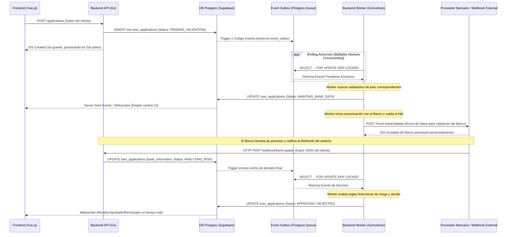

# Product Requirements Document (PRD)
## Sistema Global de Solicitudes de Crédito (Fintech)

### 1. Visión y Objetivos
Construir el sistema base (Core) para una Fintech multinacional que gestiona solicitudes de crédito. El sistema debe ser capaz de operar a gran escala, procesando solicitudes de manera concurrente y asíncrona, y debe estar diseñado con una arquitectura modular que permita incorporar rápidamente nuevos países, proveedores bancarios y flujos de negocio.

### 2. Alcance del Producto
El sistema abarcará desde la captación de la solicitud por parte del usuario, validación de reglas de negocio específicas por país, consulta a proveedores bancarios locales, hasta el procesamiento asíncrono para la determinación del estado del crédito y notificaciones a sistemas externos, reflejando todo en tiempo casi real en una interfaz de usuario.

---

### 3. Stack Tecnológico

*   **Backend:** **Go (Golang)**. Elegido por su excelente manejo nativo de la concurrencia (Goroutines), eficiencia en recursos y tipado fuerte. Es ideal para construir sistemas que requieren procesamiento en paralelo y alta escalabilidad.
    *   **Arquitectura Limpia y Domain-Driven Design (DDD):** El código estará estrictamente separado en capas: **Dominio** (entidades y reglas de negocio puras, sin dependencias externas), **Aplicación** (casos de uso que orquestan el negocio) e **Infraestructura** (base de datos, APIs externas). Las entradas HTTP (*Handlers/Controllers*) estarán aisladas de la lógica.
    *   **Patrones de Diseño Clave:**
        *   **Patrón Repository:** Abstrayendo el acceso a datos. La capa de dominio interactuará con las entidades a través de interfaces de repositorios, desconociendo si debajo hay Postgres o un Mock.
        *   **Unit of Work (UoW):** Trabajará en conjunto con los repositorios para garantizar **Transaccionalidad Atómica**. Por ejemplo, al crear una solicitud, la inserción en `loan_applications` y la creación del evento en `event_outbox` ocurrirán bajo una misma transacción SQL. Si una falla, se hace *rollback* completo.
*   **Frontend:** **Vue.js**. Elegido por su reactividad fluida, ligereza y excelente integración para construir dashboards en tiempo real (mediante WebSockets o Server-Sent Events). Su curva de aprendizaje y arquitectura progresiva facilitan un diseño "simple y minimalista" como se requiere.
*   **Base de Datos y Autenticación:** **PostgreSQL (Supabase)**. Elegido por sus capacidades nativas avanzadas (Triggers, Funciones, `SKIP LOCKED` para colas) y por resolver la autenticación JWT y políticas de seguridad (RLS) de forma integral.
*   **Infraestructura:** Todo estará dockerizado y pensado para desplegarse mediante archivos de **Kubernetes (K8s)**. Balanceador de carga con **Nginx**.

---

### 4. Especificaciones de Dominio (Specification-Driven Design)

#### 4.1. Entidades Principales y Puntos de Entrada
*   **Usuario (User/Admin):** Totalmente gestionados por el módulo **Auth de Supabase** (Manejo de contraseñas, JWT, Roles).
    *   **Puntos de Entrada para Solicitudes:** Existirán dos vías principales para solicitar un crédito:
        1.  **Portal Frontend (B2C):** Un usuario registrado se loguea en la plataforma web (Vue.js) y llena el formulario directamente.
        2.  **API REST (B2B/Integraciones):** El sistema expondrá endpoints documentados para que la solicitud pueda ser inyectada directamente por otros sistemas (ej. un CRM de la empresa) enviando un Token JWT válido.
        *   **Seguridad de API (Validación JWT):** El Backend en Go no confiará ciegamente en el cliente. Todo request a la API deberá pasar por un Middleware que valide criptográficamente la firma del JWT originado por Supabase (usando el secreto del proyecto de Supabase), verificando así la autenticidad y caducidad del token antes de procesar cualquier solicitud.
*   **Solicitud de Crédito (Loan Application):** Entidad central.
*   **País (Country):** Entidad de configuración que define reglas y flujos de estado.
*   **Proveedor Bancario (Bank Provider):** Entidad externa (mock). Diferente por país.

#### 4.2. Gestión de Estados por País (Máquina de Estados)
Las solicitudes no tienen un flujo de estados estático; dependen del país.

**Flujo Propuesto (Manejado por Workers):**
1.  `DRAFT`: Solicitud incompleta.
2.  `PENDING_VALIDATION`: Solicitud enviada, guardada rápido en BD. Entra a la cola asíncrona.
3.  `AWAITING_BANK_DATA`: (O estado intermedio como validación de CURP/NIF). Worker está consultando/esperando al banco.
4.  `ANALYZING_RISK`: Datos bancarios obtenidos, el Worker evalúa la regla de negocio.
5.  `APPROVED` / `REJECTED`: Decisión final tomada por el Worker o tras recibir el **Webhook** de confirmación del banco.

#### 4.3. Reglas de Negocio Específicas
*   **Portugal (PT):** Documento NIF. Pago mensual <= 35% de ingreso mensual.
*   **Colombia (CO):** Documento Cédula. Relacion entre deuda total y el ingreso mensual.

---

### 5. Esquema de Base de Datos (dbdiagram.io)

El siguiente esquema en formato *dbdiagram* define las tablas y relaciones del sistema. Usamos `event_outbox` como nuestra cola de procesamiento asíncrono.

```dbml
// ==========================================
// CORE DOMAIN & ACCESS
// ==========================================
Table users {
  id uuid [pk]
  full_name varchar
  role varchar // 'ADMIN' or 'USER'
}

Table countries {
  id int [pk]
  iso_code varchar // 'PT', 'MX'
  name varchar
  currency varchar
}

Table bank_providers {
  id int [pk]
  country_id int [ref: > countries.id]
  provider_name varchar
  api_config jsonb
}

// ==========================================
// BUSINESS LOGIC
// ==========================================
Table loan_applications {
  id uuid [pk]
  user_id uuid [ref: > users.id]
  country_id int [ref: > countries.id]
  borrower_name varchar
  identity_document varchar
  requested_amount numeric
  monthly_income numeric
  status varchar // 'DRAFT' (default), 'PENDING_VALIDATION', 'AWAITING_BANK_DATA', 'APPROVED', 'REJECTED'
  bank_information jsonb // Data variable del proveedor bancario
  requested_at timestamp
  created_at timestamp
  updated_at timestamp
}

Table loans {
  id uuid [pk]
  application_id uuid [ref: - loan_applications.id]
  user_id uuid [ref: > users.id]
  amount numeric
  interest_rate numeric
  status varchar // 'ACTIVE', 'PAID', 'DEFAULTED'
  disbursed_at timestamp // Fecha en la que se envió el dinero
  created_at timestamp
  updated_at timestamp
}

Table event_outbox {
  id uuid [pk]
  event_type varchar // ej. 'VALIDATE_MX_RULES', 'FETCH_BANK_DATA'
  payload jsonb // Datos necesarios para ejecutar la tarea
  status varchar // 'PENDING', 'PROCESSING', 'DONE', 'FAILED'
  created_at timestamp
  locked_at timestamp // Manejo de concurrencia
}

Table webhook_logs {
  id uuid [pk]
  event_id uuid [ref: > event_outbox.id]
  url_called varchar
  payload jsonb
  http_status_returned int
  created_at timestamp
}
```

---

### 6. Arquitectura General y Flujo Asíncrono (Webhooks y Workers)

El sistema utilizará un enfoque asíncrono. Cuando un usuario envía una solicitud, la API principal simplemente la guarda en la base de datos y responde rápidamente. A partir de allí, todo ocurre en segundo plano mediante **Workers en Go** que se alimentan de la tabla `event_outbox` usando `SKIP LOCKED` para permitir paralelismo sin tomar los mismos datos.

Llegado el momento de hablar con el banco, mockearemos llamadas asíncronas para simular proveedores bancarios lentos.

#### 6.1. Orquestación Guiada por Eventos (Configuración por País)
Para garantizar una mantenibilidad extrema, la concatenación de eventos (el *pipeline* de tareas asíncronas) no estará *hardcodeada* (escrita rígidamente) en el código. Se definirá un motor u orquestador simple alimentado por un archivo de configuración (ej. `workflows.json` o equivalente).

Si en el futuro un banco exige un nuevo paso de validación, bastará con desarrollar el trabajador de esa tarea y actualizar este JSON, sin alterar la lógica de los Workers existentes.

**Ejemplo de flujo de eventos concatenados (Pipeline):**
1.  **Evento Inicial (`LOAN_APPLICATION_CREATED`)**: Al guardar la solicitud inicial en DB, un Trigger genera este evento en el *EventBus*.
2.  **Orquestador**: Un Worker lee el flujo definido para ese país y dispara la siguiente acción: `FETCH_BANK_DATA`.
3.  **Evento Intermedio (`FETCH_BANK_DATA`)**: Un Worker solicita la información bancaria (vía Mock). Al completar esto, marca el evento como `DONE` y encola el siguiente en el flujo: `EVALUATE_APPLICATION_RISK`.
4.  **Evento Final (`EVALUATE_APPLICATION_RISK`)**: El Worker toma el evento, ejecuta las reglas de negocio, y dicta el veredicto final cambiando el estado del crédito.

#### 6.2. Diagrama de Secuencia del Flujo Asíncrono



#### Explicación del Patrón Asíncrono
1.  **Recepción y Liberación Rápida:** La API inserta y responde `201 Created` al instante. Nunca bloquea al cliente esperando validaciones complejas.
2.  **Workers (Goroutines en Go):** Existen procesos en Go ejecutándose continuamente. Estos consumen transacciones de la tabla `event_outbox` de PostgreSQL mediante cláusulas de concurrencia nativas para no enredarse.
3.  **Comunicación Bidireccional:** El frontend de Vue.js está suscrito (ej. Socket.io o Supabase Realtime). Cada vez que un *Worker* o el *Webhook* actualizan el registro en Postgres, el Front detecta el cambio de estado y la interfaz se repinta automáticamente.
4.  **Webhooks (Mocks):** Para cumplir el requerimiento del negocio, se simulará que el banco no responde inmediatamente. El sistema envía los datos a una URL ficticia y espera que el "banco" golpee el endpoint Webhook interno (`/webhook/bank-update`) para continuar el flujo.

---

### 7. Requerimientos Operativos adicionales definidos

*   **Listado (Filtros y Caché):** Los listados usarán Redis (u otro tipo de caché en memoria en Go) para evitar golpear la tabla `loan_applications` ante cada recarga, invalidando la caché sólo tras la recepción de un Webhook o actualización del sistema. En este endpoint de listar solicitudes, este tiene que tener la capacidad de filtraralas por pais, monto solicitado, ingreso mensual, estado, documento de identidad y nombre de la persona, se debe poder combinar los filtros
*   **Manejo de Errores e ID:** El logs del backend contará con un `request_id` trazable desde que la solicitud entra por la API, pasa por la base de datos, entra a la cola y sale hacia el webhook del banco.
