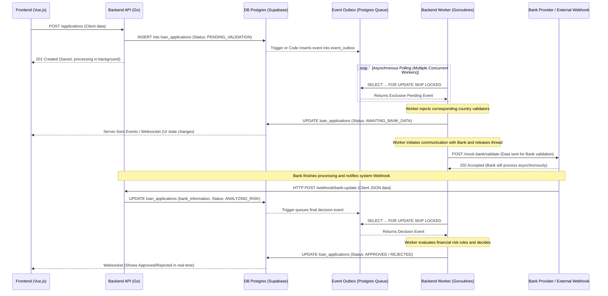

# Product Requirements Document (PRD)
## Global Credit Application System (Fintech)

### 1. Vision and Objectives
Build the core system for a multinational Fintech that manages credit applications. The system must be capable of operating at large scale, processing applications concurrently and asynchronously, and must be designed with a modular architecture that allows rapid incorporation of new countries, bank providers, and business flows.

### 2. Product Scope
The system will cover from user application capture, validation of country-specific business rules, queries to local bank providers, to asynchronous processing for credit status determination and notifications to external systems, reflecting everything in near real-time in a user interface.

---

### 3. Technology Stack

*   **Backend:** **Go (Golang)**. Chosen for its excellent native concurrency handling (Goroutines), resource efficiency, and strong typing. It's ideal for building systems that require parallel processing and high scalability.
    *   **Clean Architecture and Domain-Driven Design (DDD):** Code will be strictly separated into layers: **Domain** (pure entities and business rules, without external dependencies), **Application** (use cases that orchestrate business) and **Infrastructure** (database, external APIs). HTTP entries (*Handlers/Controllers*) will be isolated from logic.
    *   **Key Design Patterns:**
        *   **Repository Pattern:** Abstracting data access. The domain layer will interact with entities through repository interfaces, unaware whether Postgres or a Mock lies beneath.
        *   **Unit of Work (UoW):** Will work together with repositories to guarantee **Atomic Transactionality**. For example, when creating an application, the insertion into `loan_applications` and the creation of the event in `event_outbox` will occur under the same SQL transaction. If one fails, a complete *rollback* is performed.
*   **Frontend:** **Vue.js**. Chosen for its fluid reactivity, lightweight nature, and excellent integration for building real-time dashboards (via WebSockets or Server-Sent Events). Its learning curve and progressive architecture facilitate a "simple and minimalist" design as required.
*   **Database and Authentication:** **PostgreSQL (Supabase)**. Chosen for its advanced native capabilities (Triggers, Functions, `SKIP LOCKED` for queues) and for comprehensively solving JWT authentication and security policies (RLS).
*   **Infrastructure:** Everything will be dockerized and designed for deployment via **Kubernetes (K8s)** files. Load balancer with **Nginx**.

---

### 4. Domain Specifications (Specification-Driven Design)

#### 4.1. Main Entities and Entry Points
*   **User (User/Admin):** Fully managed by **Supabase Auth** module (Password management, JWT, Roles).
    *   **Entry Points for Applications:** There will be two main ways to request credit:
        1.  **Frontend Portal (B2C):** A registered user logs into the web platform (Vue.js) and fills out the form directly.
        2.  **REST API (B2B/Integrations):** The system will expose documented endpoints so applications can be injected directly by other systems (e.g., company CRM) by sending a valid JWT Token.
        *   **API Security (JWT Validation):** The Go Backend will not blindly trust the client. Every API request must go through a Middleware that cryptographically validates the JWT signature originated by Supabase (using the Supabase project secret), thus verifying token authenticity and expiration before processing any request.
*   **Loan Application:** Central entity.
*   **Country:** Configuration entity that defines rules and state flows.
*   **Bank Provider:** External entity (mock). Different per country.

#### 4.2. State Management by Country (State Machine)
Applications don't have a static state flow; they depend on the country.

**Proposed Flow (Handled by Workers):**
1.  `DRAFT`: Incomplete application.
2.  `PENDING_VALIDATION`: Application submitted, quickly saved in DB. Enters asynchronous queue.
3.  `AWAITING_BANK_DATA`: (Or intermediate state like CURP/NIF validation). Worker is querying/waiting for the bank.
4.  `ANALYZING_RISK`: Bank data obtained, Worker evaluates business rule.
5.  `APPROVED` / `REJECTED`: Final decision made by Worker or after receiving bank confirmation **Webhook**.

#### 4.3. Specific Business Rules
*   **Portugal (PT):** NIF document. Monthly payment <= 35% of monthly income.
*   **Colombia (CO):** Cédula document. Relationship between total debt and monthly income.

---

### 5. Database Schema (dbdiagram.io)

The following schema in *dbdiagram* format defines the system tables and relationships. We use `event_outbox` as our asynchronous processing queue.

```dbml
// ==========================================
// CORE DOMAIN & ACCESS
// ==========================================
Table users {
  id uuid [pk]
  full_name varchar
  role varchar // 'ADMIN' or 'USER'
}

Table countries {
  id int [pk]
  iso_code varchar // 'PT', 'MX'
  name varchar
  currency varchar
}

Table bank_providers {
  id int [pk]
  country_id int [ref: > countries.id]
  provider_name varchar
  api_config jsonb
}

// ==========================================
// BUSINESS LOGIC
// ==========================================
Table loan_applications {
  id uuid [pk]
  user_id uuid [ref: > users.id]
  country_id int [ref: > countries.id]
  borrower_name varchar
  identity_document varchar
  requested_amount numeric
  monthly_income numeric
  status varchar // 'DRAFT' (default), 'PENDING_VALIDATION', 'AWAITING_BANK_DATA', 'APPROVED', 'REJECTED'
  bank_information jsonb // Variable data from bank provider
  requested_at timestamp
  created_at timestamp
  updated_at timestamp
}

Table loans {
  id uuid [pk]
  application_id uuid [ref: - loan_applications.id]
  user_id uuid [ref: > users.id]
  amount numeric
  interest_rate numeric
  status varchar // 'ACTIVE', 'PAID', 'DEFAULTED'
  disbursed_at timestamp // Date when money was sent
  created_at timestamp
  updated_at timestamp
}

Table event_outbox {
  id uuid [pk]
  event_type varchar // e.g. 'VALIDATE_MX_RULES', 'FETCH_BANK_DATA'
  payload jsonb // Data needed to execute the task
  status varchar // 'PENDING', 'PROCESSING', 'DONE', 'FAILED'
  created_at timestamp
  locked_at timestamp // Concurrency handling
}

Table webhook_logs {
  id uuid [pk]
  event_id uuid [ref: > event_outbox.id]
  url_called varchar
  payload jsonb
  http_status_returned int
  created_at timestamp
}
```

---

### 6. General Architecture and Asynchronous Flow (Webhooks and Workers)

The system will use an asynchronous approach. When a user submits an application, the main API simply saves it to the database and responds quickly. From there, everything happens in the background through **Workers in Go** that feed from the `event_outbox` table using `SKIP LOCKED` to allow parallelism without taking the same data.

When it's time to talk to the bank, we'll mock asynchronous calls to simulate slow bank providers.

#### 6.1. Event-Driven Orchestration (Country Configuration)
To ensure extreme maintainability, the concatenation of events (the *pipeline* of asynchronous tasks) will not be *hardcoded* (rigidly written) in the code. A simple engine or orchestrator will be defined, fed by a configuration file (e.g., `workflows.json` or equivalent).

If in the future a bank requires a new validation step, it will be enough to develop the worker for that task and update this JSON, without altering the logic of existing Workers.

**Example of concatenated event flow (Pipeline):**
1.  **Initial Event (`LOAN_APPLICATION_CREATED`)**: When saving the initial application in DB, a Trigger generates this event in the *EventBus*.
2.  **Orchestrator**: A Worker reads the flow defined for that country and triggers the next action: `FETCH_BANK_DATA`.
3.  **Intermediate Event (`FETCH_BANK_DATA`)**: A Worker requests bank information (via Mock). Upon completing this, marks the event as `DONE` and queues the next in the flow: `EVALUATE_APPLICATION_RISK`.
4.  **Final Event (`EVALUATE_APPLICATION_RISK`)**: The Worker takes the event, executes business rules, and dictates the final verdict by changing the credit status.

#### 6.2. Asynchronous Flow Sequence Diagram



#### Asynchronous Pattern Explanation
1.  **Fast Reception and Release:** The API inserts and responds `201 Created` instantly. Never blocks the client waiting for complex validations.
2.  **Workers (Goroutines in Go):** Go processes run continuously. These consume transactions from the PostgreSQL `event_outbox` table using native concurrency clauses to avoid conflicts.
3.  **Bidirectional Communication:** The Vue.js frontend is subscribed (e.g., Socket.io or Supabase Realtime). Whenever a *Worker* or *Webhook* updates the record in Postgres, the Frontend detects the state change and the interface automatically repaints.
4.  **Webhooks (Mocks):** To meet business requirements, we'll simulate that the bank doesn't respond immediately. The system sends data to a fictitious URL and waits for the "bank" to hit the internal Webhook endpoint (`/webhook/bank-update`) to continue the flow.

---

### 7. Additional Defined Operational Requirements

*   **Listing (Filters and Cache):** Listings will use Redis (or another type of in-memory cache in Go) to avoid hitting the `loan_applications` table on each reload, invalidating the cache only after receiving a Webhook or system update. This endpoint for listing applications must have the capability to filter by country, requested amount, monthly income, status, identity document, and person's name; filters must be combinable.
*   **Error Handling and ID:** Backend logs will have a traceable `request_id` from when the request enters the API, goes through the database, enters the queue, and goes out to the bank webhook.
